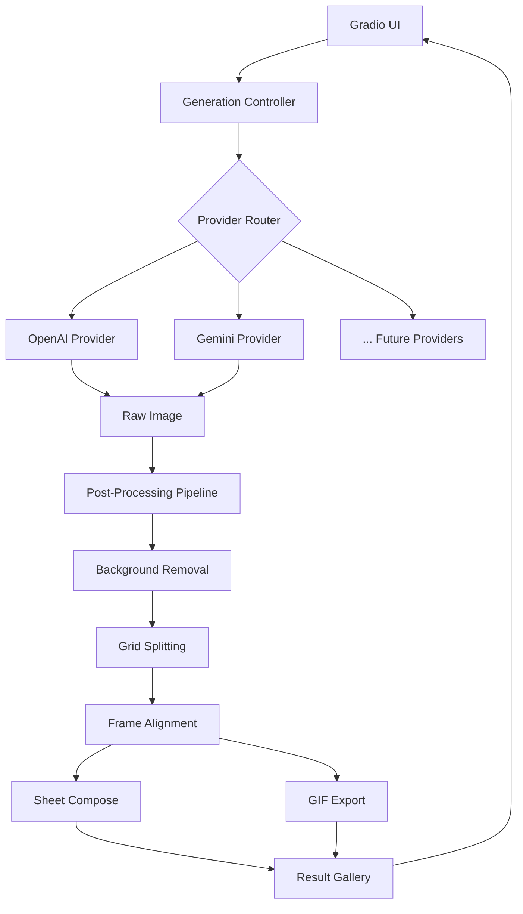

## Product Overview

一个基于 Python 的 2D 游戏 Sprite 资产生成工具（原型产品），通过 Gradio 提供简单的 Web 界面，支持用户输入文本提示词或参考图片来生成游戏用 sprite 图片和动画。

## Core Features

- **多模态输入**：支持文本提示词输入和参考图片上传，用户可选择资产类型（creature, player, prop 等）和动作模式（idle, walk, attack 等）
- **多 LLM API 生图**：统一抽象接口，先支持 OpenAI image generation，架构上兼容 Gemini 等其它多模态 LLM API
- **完整后处理流水线**：洋红色背景移除（色度键）、边框修剪、边缘清理、连通组件分析、网格分帧、帧对齐/统一缩放、透明 sheet 合成、透明 GIF 动画导出
- **结果预览界面**：左侧为输入区（提示词、图片、参数配置），右侧为结果预览区（原始图、处理后 sheet、逐帧预览、动画 GIF 播放）
- **输出导出**：支持下载透明 PNG 帧、sprite sheet、动画 GIF

## Tech Stack

| 层面 | 技术 |
| --- | --- |
| 语言 | Python 3.11+ |
| UI 框架 | Gradio |
| 图像处理 | Pillow, NumPy |
| LLM API | OpenAI SDK (gpt-image-1), google-genai (Gemini) |
| 配置管理 | python-dotenv (.env 文件) |
| 包管理 | pip + venv |


## Implementation Approach

**核心策略**：采用 Provider 抽象模式，将图像生成与后处理解耦为两个独立模块。前端使用 Gradio 快速搭建交互界面。

**工作原理**：

1. 用户通过 Gradio 界面输入提示词/图片和参数配置
2. 系统根据用户选择的 provider（OpenAI/Gemini）调用对应的图像生成 API
3. 生成的原始图像经过后处理管线（去背景 → 分帧 → 对齐 → 导出）
4. 处理结果在界面右侧实时预览

**关键技术决策**：

- **Provider 抽象**：定义 `ImageProvider` 基类，每个 LLM API 实现一个子类，通过工厂模式创建。这样新增 provider 只需添加一个文件，不改动核心逻辑。
- **后处理复用**：直接借鉴 agent-sprite-forge 的色度键去背景算法（flood-fill + 边缘扩散），经过验证效果良好。
- **Prompt 构建**：内置 sprite 生成的 prompt 模板（强制洋红色背景、网格规则等），确保生成结果可被后处理正确解析。

## Implementation Notes

- **Prompt 设计**：所有生成请求必须包含 "#FF00FF 纯色背景" 约束，这是后处理色度键去背景的前提
- **API 超时**：图像生成 API 可能耗时较长（10-30s），Gradio 需设置合理超时，并展示进度提示
- **内存管理**：大尺寸图像（1024x1024）的 NumPy 数组处理注意内存，处理完及时释放
- **错误处理**：API key 缺失、网络错误、生成失败等需友好提示，不能崩溃
- **后处理性能**：connected_components BFS 对大图可能较慢，但作为原型产品可接受

## Architecture Design



**模块划分**：

- **providers/**：图像生成提供者，每个 API 一个文件，统一接口
- **processing/**：后处理管线，函数式设计，可独立调用每个步骤
- **ui/**：Gradio 界面定义
- **config.py**：配置加载（环境变量、默认参数）

## Directory Structure

```
d:\yellow\sprite-generator\
├── README.md                    # [MODIFY] Project documentation in English
├── LICENSE                      # [EXISTING] Keep as is
├── requirements.txt             # [NEW] Python dependencies: gradio, openai, google-genai, Pillow, numpy, python-dotenv
├── .env.example                 # [NEW] Example environment variables (API keys template)
├── .gitignore                   # [NEW] Python/IDE/output gitignore
├── src/
│   ├── __init__.py              # [NEW] Package init
│   ├── app.py                   # [NEW] Main entry point. Creates and launches Gradio app, wires UI to controller.
│   ├── config.py                # [NEW] Configuration loading. Reads .env, defines defaults for thresholds, cell sizes, durations, available providers.
│   ├── controller.py            # [NEW] Generation controller. Orchestrates the full pipeline: prompt building -> image generation -> post-processing -> result packaging. Returns structured output for UI display.
│   ├── prompt_builder.py        # [NEW] Prompt template builder. Constructs optimized prompts for sprite generation with magenta background constraints, grid rules, style rules based on asset type and mode. References agent-sprite-forge patterns.
│   ├── providers/
│   │   ├── __init__.py          # [NEW] Provider package init. Exports provider registry and factory function.
│   │   ├── base.py              # [NEW] Abstract base class ImageProvider. Defines interface: generate(prompt, reference_image, size) -> PIL.Image. Also defines ProviderConfig dataclass.
│   │   ├── openai_provider.py   # [NEW] OpenAI image generation provider. Uses openai SDK to call gpt-image-1 API. Supports text-to-image and image editing with reference. Handles API errors gracefully.
│   │   └── gemini_provider.py   # [NEW] Google Gemini image generation provider. Uses google-genai SDK. Implements same interface as OpenAI provider for seamless switching.
│   ├── processing/
│   │   ├── __init__.py          # [NEW] Processing package init.
│   │   ├── background.py        # [NEW] Background removal. Implements magenta chroma-key removal with flood-fill edge diffusion (ported from agent-sprite-forge). Also supports general background removal via alpha detection.
│   │   ├── grid.py              # [NEW] Grid operations. Split sprite sheet into frames by rows/cols, trim borders, clean edges, connected component analysis, bbox detection. Core logic from agent-sprite-forge.
│   │   ├── alignment.py         # [NEW] Frame alignment and scaling. Shared-scale computation across frames, center/bottom/feet alignment, canvas placement. Ensures consistent frame sizes.
│   │   └── export.py            # [NEW] Export utilities. Compose transparent sheet from frames, save transparent GIF with proper palette handling, save individual frame PNGs.
│   └── ui/
│       ├── __init__.py          # [NEW] UI package init.
│       └── interface.py         # [NEW] Gradio interface definition. Left panel: text input, image upload, dropdown for provider/asset-type/mode/grid-shape, parameter sliders. Right panel: raw image display, processed sheet, frame gallery, GIF animation, download buttons.
└── output/                      # [NEW] Default output directory (gitignored). Stores generated assets organized by timestamp/name.
```

## Key Code Structures

```python
# src/providers/base.py
from abc import ABC, abstractmethod
from dataclasses import dataclass
from PIL import Image

@dataclass
class GenerationRequest:
    prompt: str
    reference_image: Image.Image | None = None
    size: str = "1024x1024"
    style: str = "pixel_art"

@dataclass
class GenerationResult:
    image: Image.Image
    provider: str
    model: str
    revised_prompt: str | None = None

class ImageProvider(ABC):
    @abstractmethod
    def generate(self, request: GenerationRequest) -> GenerationResult:
        """Generate an image from the given request."""
        ...

    @abstractmethod
    def is_available(self) -> bool:
        """Check if this provider is properly configured."""
        ...
```

```python
# src/processing pipeline signature sketch
def process_sprite(
    raw_image: Image.Image,
    mode: str,
    rows: int,
    cols: int,
    cell_size: int = 128,
    threshold: int = 100,
    edge_threshold: int = 150,
    align: str = "center",
    shared_scale: bool = True,
    component_mode: str = "all",
) -> dict:
    """
    Full post-processing pipeline.
    Returns dict with keys: sheet, frames, gif_path, metadata
    """
    ...
```

## Agent Extensions

### SubAgent

- **code-explorer**
- Purpose: Explore agent-sprite-forge source code for detailed implementation reference during development
- Expected outcome: Extract specific algorithm implementations (background removal, grid splitting) to accurately port into this project